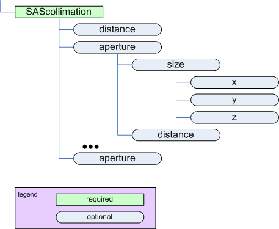

.. $Id$

.. index:: ! element; SAScollimation

.. _SAScollimation:

============================
*SAScollimation* element
============================

parent:
	:ref:`SASinstrument`

    
    The *SAScollimation* element

.. index::
	element; length
	element; aperture

============================== =========== ============ =========================================== ====================================
Name                           Type        Occurrence   Description                                 Attributes
============================== =========== ============ =========================================== ====================================
*length*                       float       [0..1]       Amount/length of collimation inserted       *unit={unit}*
                                                        (on a SANS instrument)
:ref:`SAScollimation.aperture` container   [0..inf]     Description of a slit or aperture. 
                                                        *name*: Optional name attribute for this 
                                                        aperture.  
                                                
                                                        *type*: Optional text attribute to          *name={type}*
                                                        describe the type of aperture 
                                                        (pinhole, 4-blade slit, 
                                                        Soller slit, ...).
============================== =========== ============ =========================================== ====================================

.. _SAScollimation.aperture:

aperture
===========

.. index::
	element; size
	element; distance

=========================== =========== ============ =========================================== ====================================
Name                        Type        Occurrence   Description                                 Attributes
=========================== =========== ============ =========================================== ====================================
:ref:`SAScollimation.size`  container   [0..1]       Opening dimensions of this aperture.        *name={name}*
*distance*                  float       [0..1]       Distance from this collimation element      *unit={unit}* 
                                                     to the sample.
=========================== =========== ============ =========================================== ====================================

.. _SAScollimation.size:

size
===========

.. index::
	geometry; translation
	element; x
	element; y
	element; z

+------------------------------------------------------------------+--------------------------------------------------------------------+
| view from source                                                 | view from detector                                                 |
+==================================================================+====================================================================+
| .. figure:: ../../graphics/translation-orientation-geometry.jpg  | .. figure:: ../../graphics/translation-orientation-geometry-2.jpg  |
|     :alt: view from source                                       |     :alt:                                                          |
|     :width: 350 px                                               |     :width: 350 px                                                 |
+------------------------------------------------------------------+--------------------------------------------------------------------+

.. tip:: While :math:`z` is allowed 
	by the standard (provided by use of 
	a standard element in the XML Schema), 
	it does not make sense for 
	small-angle scattering.

====================== =========== ============ =========================================== ====================================
Name                   Type        Occurrence   Description                                 Attributes
====================== =========== ============ =========================================== ====================================
:math:`x`              float       [0..1]       Dimension of the collimation in X.          *unit={unit}*
                                                The *unit* attribute is required. See
                                                :ref:`rules` for acceptable values.
:math:`y`              float       [0..1]       Dimension of the collimation in Y.          *unit={unit}*
                                                The *unit* attribute is required. See
                                                :ref:`rules` for acceptable values.
:math:`z`              float       [0..1]       Dimension of the collimation in Z.          *unit={unit}*
                                                The *unit* attribute is required. See
                                                :ref:`rules` for acceptable values.

====================== =========== ============ =========================================== ====================================
