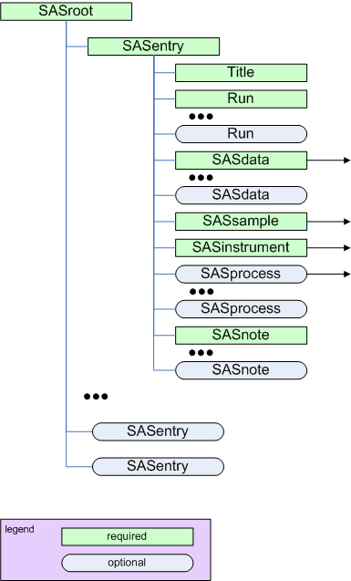

.. $Id$

.. index:: ! element; SASroot

.. _SASroot:

============================
*SASroot* element
============================

parent:
	:ref:`XML Header`

    
    The *SASroot* element

=========== =========== ============ ===================================== ===========================
Name        Type        Occurrence   Description                           Attributes
=========== =========== ============ ===================================== ===========================
*SASentry*  container   [1..inf]     A single SAS scan is reported in a    ``name="short-name"``
                                     *SASentry*. Include as many
                                     *SASentry* elements as desired.
                                     They may contain related or
                                     unrelated data. name is an optional
                                     attribute to provide a string for
                                     this *SASentry*. (Use of this string
                                     is not defined by this standard.)
=========== =========== ============ ===================================== ===========================
